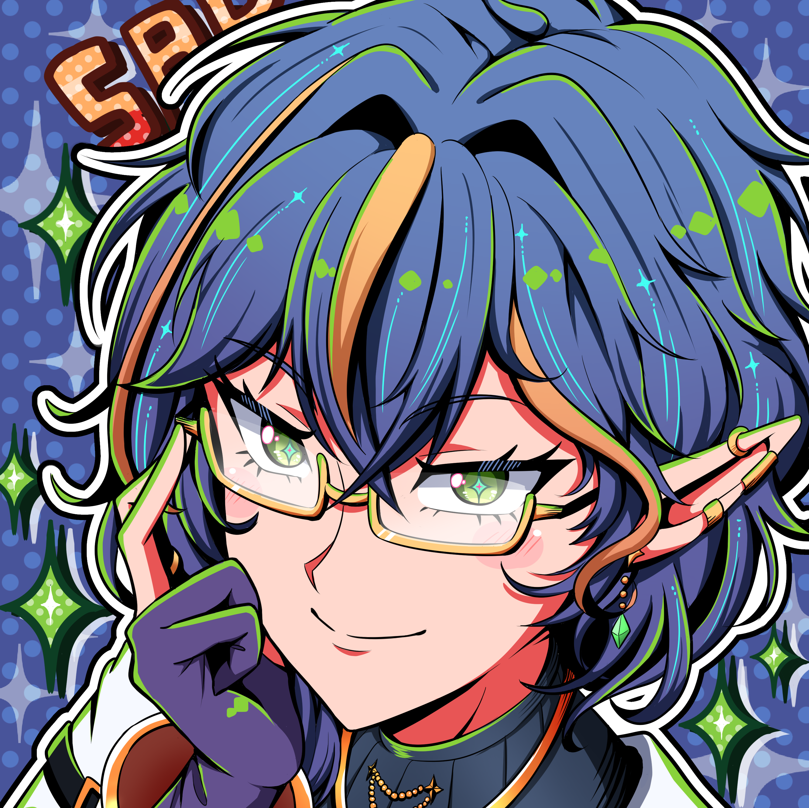

<p align="center">
  
</p>

<h1 align="center">Sarxina Plugin Manager</h1>

<p align="center">
  A desktop app for managing <a href="https://github.com/Sarxina/Random-VTuber-Toys">Sarxina's VTube Studio plugins</a>.
</p>

<p align="center">
  <a href="https://github.com/Sarxina/sarxina-plugin-manager/releases/latest">Download</a> ·
  <a href="https://x.com/SarxinaVT">@SarxinaVT</a>
</p>

---

## What It Does

- Install Sarxina VTube Studio plugins with one click
- Toggle plugins on and off, configure their options
- Coming soon: quickly change how plugins are triggered — chat or redemption

## Available Plugins

| Plugin | What It Does |
|---|---|
| **AO3 Tagger** | Chat tags your model with AO3-style tags |
| **Foxy Jumpscare** | 1/10000 chance per second of a Withered Foxy jumpscare |
| **GetDown** | Randomize your model's movements |

More coming soon.

## Getting Started

1. **Download** the latest release for your platform from the [releases page](https://github.com/Sarxina/sarxina-plugin-manager/releases/latest)
2. **Run the installer** (`.dmg` for Mac, `Setup.exe` for Windows)
3. **Connect to Twitch** in Settings
4. **Connect to VTube Studio** — make sure VTS is running with the API enabled
5. **Install a plugin** and toggle it on

## Requirements

- [VTube Studio](https://store.steampowered.com/app/1325860/VTube_Studio/) with the API enabled
- A Twitch account (for plugins that use chat)

## For Developers

Plugins are npm packages that export a `startToy(ctx)` function. The manager installs them from npm, dynamically imports them, and passes shared VTS + Twitch connections.

See [@sarxina/sarxina-tools](https://github.com/Sarxina/sarxina-tools) for the shared utilities and [Random-VTuber-Toys](https://github.com/Sarxina/Random-VTuber-Toys) for the plugin source code.

## Building From Source

```
git clone https://github.com/Sarxina/sarxina-plugin-manager.git
cd sarxina-plugin-manager
npm install
npm run dev
```
